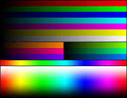

# Image Stenography
##### Manoel   

### What is Stenography?
Steganography is the practice of hiding a secret message in something that is not secret.
There are many different forms of stenography in the digital world:
- Image
- Video
- Audio
- Text

I will be focusing on Image Steganography; specifically one version of it: Hiding an image inside of another image.

### History Of Stenography:

Origin of the word stenography dates back to Ancient Greece, in "stegano" and "grafia", and together this means “secret writing”.
Ancient Greeks would carve messages on the wood of wax tablets without wax, and then cover the message with wax to make it appear as to no message exists. Romans would also use “invisible ink” to write secret messages on other, less secretive documents.

### My Program: Overview:

My program is designed to hide an image inside another image by changing the least significant bit in the Red Green and Blue values of a pixel in an image with values, either to make a 8 bit black and white image or a 9 bit color image (3 bits per color channel).

For the purposes of this demonstration, I will be using this image to hide:

And this image as the image that the above image will hide in:

#### Using the Program:

Use if you are ok with the final image once decoded being black and white.
flags: _ -i IMAGETOHIDE -h IMAGETOHIDEINPUTIN -o OUPUTFILENAME -m __
Replace _ with -e or -d.
Replace __ with COLOR or BW.
-d does not require you to use -h.
If you want the image to be displayed use -v

### Black and White Mode:
#### Usage:
Use if you are ok with the final image once decoded being black and white.

#### Setup:
To prepare for black and white image encoding, my program first changes the image to hide into a monochrome image using filter() in processing.
Then, the image to hide will be centered on top of the image that will appear unchanged at the end.

#### Encoding:
Then, the program will go over every single pixel of the (now) centered image.
On each pixel, the program will read the brightness of the pixel and split the 8 bytes into 3 3 byte numbers
For example, a pixel with a value of 125 (01111101) would become 001 111 101.
Then, each of the three binary values will be put into the least signigicant bits in the red, green, and blue channels of the image that will appear unchanged.
The program continues until all pixels covered by the image to hide are converted.

Output:

#### Decoding:
The program will run over every single pixel and basically undo what was done above. Grabs the least significant bits from the image, and puts them back together into a 8 bit brightness value for the pixel. The pixel is then replaced with this value. This results in a image that has noise around a clearish image in the center.

Output:

### Color Mode:

### Usage:

Use this mode if you want specifically color encoding. The output will have worse color depth, having only 3 bits per color instead of the 8 we normally use.

#### Setup:

Besides centering its position over the image to hide in, the program does nothing else in color mode.

#### Encoding:

In Color mode, the program once again runs over all the pixel the image to be hidden is over. It converts the red, green, and blue into their binary forms. It will then lift the 3 most significant digits and place them in the 3 least significant digits of the image it will be hidden in.
The program runs this over all pixels covered by the image to hide.

#### Decoding:

To decode, because the values are still in the same channel, it effectively bit shifts the 3 least significant digits to the front, replacing the rest with 0s. This results in an image with a maximum of 512 colors, leaving a bunch of noise from the original image around a clear image in the center.

### Limitations:
The brighter the image that you're hiding the other image in is, the more visible the hidden image is (when it shouldn't be)
This is visible on the encoded examples above.
Using darker images (where the eye can see less detail) can help mitigate this.

### Usage (Why use this?)

The main resason to do something like this is obfuscation. If someone doesn't know there is a hidden image, they can't do anything about it. Additionally, these technicques could be used with other cybersecurity techniques to increase the security and decrease the chance that someone intercepts whatever you're sending.

### Resources:

`https://www.geeksforgeeks.org/early-evidence-of-steganography/` 
`https://konstantinnovation.github.io/cyber.html` 
`https://en.wikipedia.org/wiki/List_of_monochrome_and_RGB_color_formats` 
